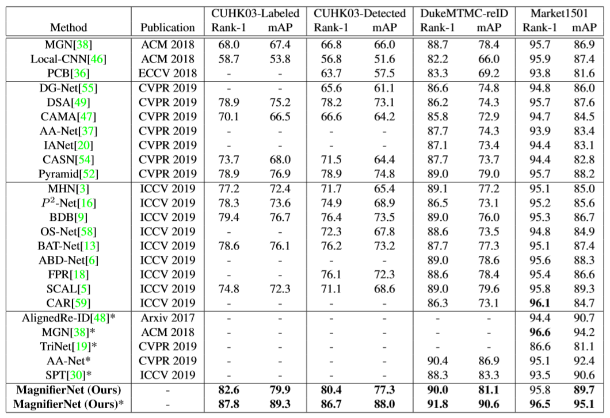

## Person Re-identification research 

I started my research in SenseTime since March 2019 as CV research intern. I mainly focus on **Target Re-Identification(REID)** on large scale dataset.

### Background
Person re-identification (ReID) has achieved significant improvement under the single-domain setting. However, directly exploiting a model to new domains is always faced with huge performance drop, and adapting the model to new domains without target-domain identity labels is still challenging. Though researchers now have reached both high accuracy and Top-K on large datasets like Market1501, CUHK03 and DukeMTMC-reID, I argue that the problem of re-identification is **far from solved**. Here I list 2 reasons below:
### False Tesing Method
   The current model testing method contradicts with real scene. ReID is essentially a **ZSL(zero shot learning)** problem and the testing domain usually share no overlap with the training domain. However, the current published paper still verify the effectiveness of their method by training and testing on the same dataset. Although the ID does not overlap, they basically share the same domain which is evidently impossible under real scene.  
### Limited Dataset Size
   The current released dataset's size cannot support the deployment of ReID system. Most published method demonstrates thir effectiveness by showing the their result on Market1501(1500 IDs) and CUHK03(1467 IDs), however, under real scene, the retrivel will be million-scale under different scenaries.
Therefore, I argue that the development future of ReID lies on the improvement of model generalization and adaptation under different scenaries.

## My work
Research at SenseTime collaborates with product closely. My group's research aim to develop the model which supports million level person retrival high average precision, which of great significnce in many scenarios. My research here focused on solving domain adaptation and model generalization with **part-based** and **semantic-aided** CNN models. 

As global feature cannot provide enough information, local and semantic information can provide auxiliary context. Thus, integration of semantic information has become the main method of boosting ReID task performance since 2018. [PCB](http://openaccess.thecvf.com/content_ECCV_2018/html/Yifan_Sun_Beyond_Part_Models_ECCV_2018_paper.html) published in ECCV 2018 and [Human Semantic Parsing for ReID](http://openaccess.thecvf.com/content_cvpr_2018/papers/Kalayeh_Human_Semantic_Parsing_CVPR_2018_paper.pdf) published in CVPR 2018 are two good examples. We want to mine the details of our retrival target and construct a robust vector representation which is insensitive to pose and view variants.

PCB: 

Person segmentation and attributes serve as mid-level semantic information and can be helpful for ReID task. My first task here is to add segmentation/attributes distillation branches after ResNet backbone network, and they did bring great improvements. I found that person segmentations act as labeled-attention to the backbone network and though visualization of saliency map, we can tell the difference. Attribute branch can help retrieve hard cases and improve the mAP performance.

As my research on ReID deepened, I found that in many hard cases, only few details can help us discriminate 2 people. Previous work cannot handle this task well and after discussion and brain storm with my advisor, it came to our mind that the local details are the keys, and we should be able to discriminate two difference IDs based on their minor differences in their semantic regions(head, leg, arms..). But how? PCB-based method lacks the fine-granularity partition of semantic regions, and other models resorted to human parsing models lackes the ability of generalization. Here we came up with our novel algorithms:

SFB&SEB: 

Based on our proposed *Semantic Aligned Pooling*, we defined two noval branches which are able to mine the details of each semantic regions and fuses them together. When any regions are missed under some circumstances,our methods can still learn rebust representation from other remaining human parts. Combined with our **Semantic Diversity Loss**, the performance can be further improved. The architecture of our entire network looks like this:

Structure: 

We name this network **MagnifierNet** for it can mine fine-grained details from limited region samples. SOTA performance can be achieved on three popular ReID benchmarks by a large margin.

Performance: 

We compare our method against 19 latest State-of-the-Art methods with the widely adopted ``Rank 1`` and ``mAP`` as our evaluation criterion. Our method achieves the best results on all the datasets except for Rank-1 on Market1501. Notably, our method outperforms other networks by a large margin on the small and challenging dataset CUHK03-NP with relatively heavy viewpoint limitation and occlusion. Further more, the MagnifierNet outperforms part-alignment related methods including BDB and P^2-Net, which validates the effectiveness of our method to go beyond alignment and further improve Re-ID performance via semantic regularization and fusion.

My work here was summarized and submitted to CVPR20. ReID is a very interesting and task-oriented direction in computer vision and I have to say 8 months research here helps me improved myself a lot. Welcome to communicate with me if you have some ideas or consideration regarding ReID research and my research life in SenseTime as undergraduate.