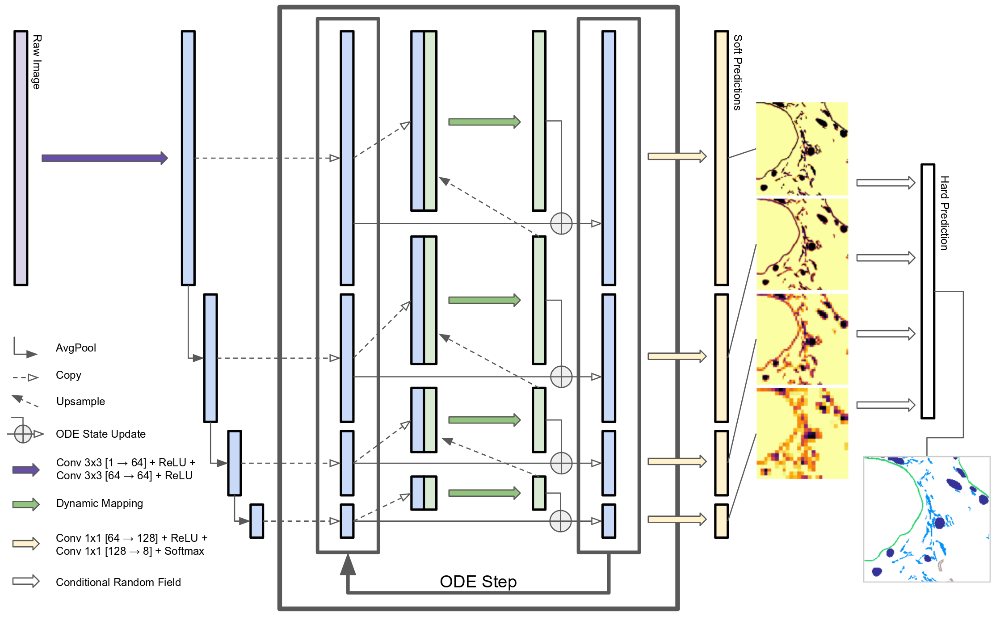

In the summer of 2019, I came to Austin, TX to enrich my understanding of computer vision and machine learning. Austin is a beautiful city, and its unique (hot) weather can always bring me some fantastic ideas.

Our proposed ODEUnet: 